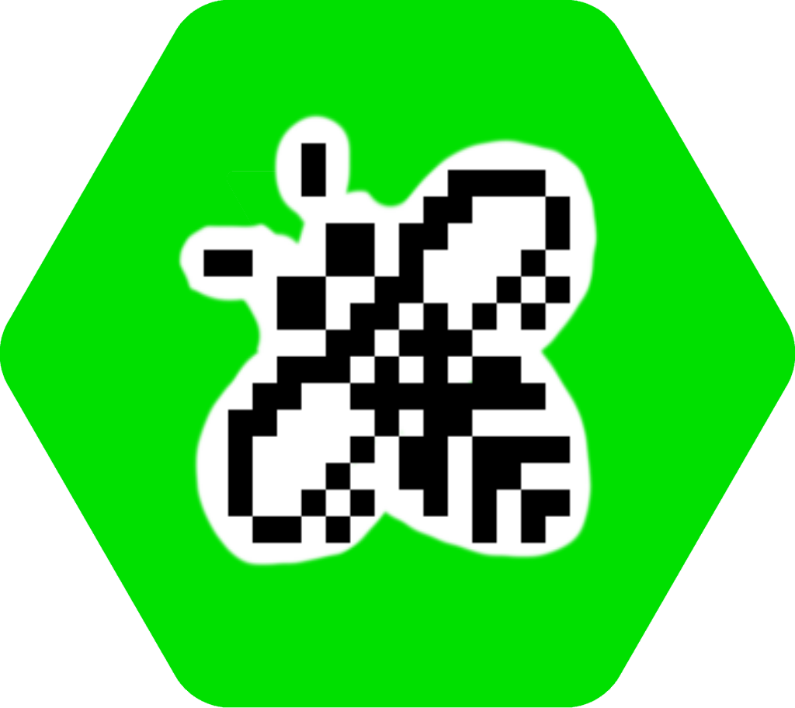
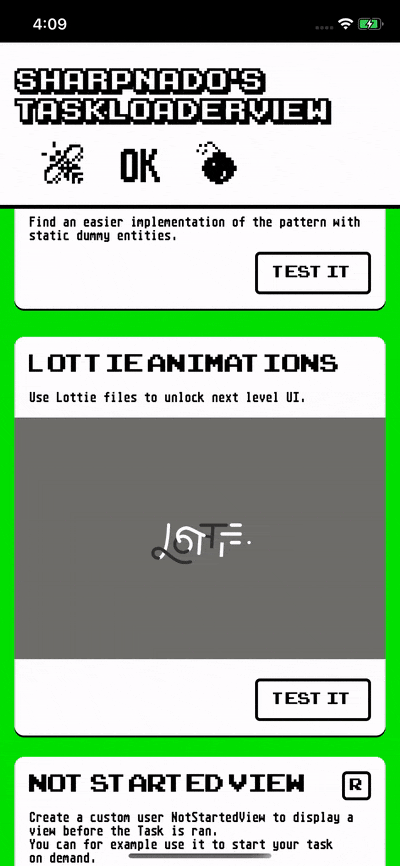
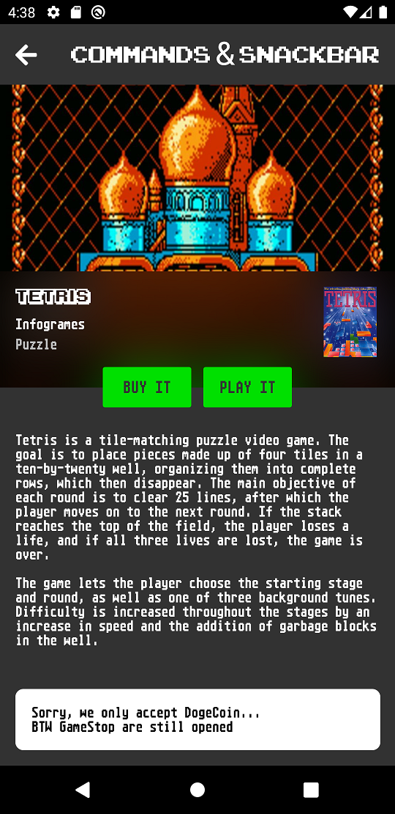
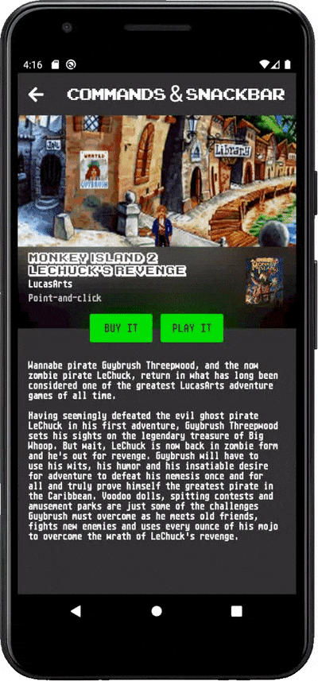

# TaskLoaderView 2.0: Let's burn IsBusy=true!





The `TaskLoaderView` is a UI component that handles all your UI loading state (Loading, Error, Result, Notification), and removes all the pain of async loading from your view models (try catch / async void / IsBusy / HasErrors / base view models / ...) thanks to its brother the `TaskLoaderNotifier`.


**Featuring:**

* Default layout for all loading states (`Loading`, `Error`, `Success`, `Notification`, `Refresh`)
* Stylable layouts including fonts, accent colors, error images, ...
* Support for async `ICommand` with `TaskLoaderCommand` and `CompositeTaskLoaderNotifier`
* Any states are overridable with user custom views and easily positioned with AbsoluteLayout properties
* Support for `Xamarin.Forms.Skeleton` nuget package
* Support for refresh scenarios, and error while refreshing with the `ErrorNotificationView`
* Support loading task on demand with the `NotStarted` state
* `TaskLoaderNotifier` for the `ViewModel` side taking care of all the error handling and the `IsBusy` nonsense


It has been tested on **Android**, **iOS** and **UWP** platforms through the `Retronado` sample app.

It uses the Sharpnado's [TaskMonitor](https://github.com/roubachof/Sharpnado.TaskMonitor).

## 2.5.0 MAUI support \o/ and TemplatedTaskLoader

Version 2.5.0 now supports .Net MAUI.

New `TemplatedTaskLoader`: it does the same job as the `TaskLoaderView` but using `ControlTemplate` instead of a absolute layout of views.

```xml
 <cv:TemplatedTaskLoader x:Name="LoaderView"
                         Grid.Row="1"
                         Style="{StaticResource TemplatedLoaderLongLoading}"
                         TaskLoaderNotifier="{Binding Loader}">
    <cv:TemplatedTaskLoader.ResultControlTemplate>
        <ControlTemplate>
            ...
        </ControlTemplate>
    </cv:TemplatedTaskLoader.ResultControlTemplate>
    <cv:TemplatedTaskLoader.ErrorControlTemplate>
        <ControlTemplate>
            ...
        </ControlTemplate>
    </cv:TemplatedTaskLoader.ErrorControlTemplate>
    <cv:TemplatedTaskLoader.LoadingControlTemplate>
        <ControlTemplate>
            ...
        </ControlTemplate>
    </cv:TemplatedTaskLoader.LoadingControlTemplate>
</cv:TemplatedTaskLoader>

...

<Style x:Key="TemplatedLoaderLongLoading"
       TargetType="customViews:TemplatedTaskLoader">
    <Setter Property="LoadingControlTemplate" Value="{StaticResource LottieRocketControlTemplate}" />
    <Setter Property="ErrorControlTemplate" Value="{StaticResource ErrorViewControlTemplate}" />
</Style>

<ControlTemplate x:Key="LottieRocketControlTemplate">
    <forms:AnimationView HorizontalOptions="Center"
                         VerticalOptions="Center"
                         HeightRequest="200"
                         WidthRequest="200"
                         Animation="delivery_truck_animation.json"
                         IsAnimating="{Binding Source={RelativeSource AncestorType={x:Type customViews:TemplatedTaskLoader}},
                                                       Path=TaskLoaderNotifier.ShowLoader}"
                         RepeatMode="Infinite" />

<ControlTemplate x:Key="ErrorViewControlTemplate">
    <StackLayout HorizontalOptions="Center"
                 VerticalOptions="Center"
                 BindingContext="{Binding Source={RelativeSource AncestorType={x:Type customViews:TemplatedTaskLoader}},
                                          Path=TaskLoaderNotifier}"
                 IsVisible="False"
                 Orientation="Vertical"
                 Spacing="10">
        <Frame Style="{StaticResource FrameCircle}"
               WidthRequest="{StaticResource SizeTaskLoaderIcon}"
               HeightRequest="{StaticResource SizeTaskLoaderIcon}"
               Margin="0,0,0,10"
               BackgroundColor="{StaticResource ColorPrimary}">
            <Image HorizontalOptions="Center"
                   VerticalOptions="Center"
                   Source="{Binding Error,
                                    Converter={converters:ExceptionToImageSourceConverter}}" />
        </Frame>
        <Label Style="{StaticResource TextBodySecondary}"
               WidthRequest="300"
               Margin="0,0,0,20"
               HorizontalTextAlignment="Center"
               LineBreakMode="WordWrap"
               MaxLines="2"
               Text="{Binding Error,
                              Converter={converters:ExceptionToErrorMessageConverter}}" />
        <sho:Shadows CornerRadius="10"
                     Shades="{StaticResource ShadowAccentBottom}">
            <Button Style="{StaticResource ButtonAccent}"
                    HorizontalOptions="Center"
                    VerticalOptions="End"
                    Command="{Binding ReloadCommand}"
                    Text="{x:Static loc:GlobalResources.Common_Retry}" />
        </sho:Shadows>
    </StackLayout>
</ControlTemplate>
```

**For all new developments, I recommend now to use the TemplatedTaskLoader, and use it with a Snackbar to handle the error notifications**.

There is an detailed example on how to use it here:

https://github.com/roubachof/Sharpnado.TaskLoaderView/blob/master/Retronado/Sample/Views/CommandsPage.xaml

and here:

https://github.com/roubachof/Sharpnado.TaskLoaderView/blob/master/Retronado/Sample/ViewModels/CommandsPageViewModel.cs

### New CompositeTaskLoaderNotifier builder and simplified wiring

You can use the new builder for the CompositeTaskLoader that will wire for you the `ShowErrorNotification` of your loaders, and the errors from your `TaskLoaderCommand`:

```csharp
CompositeNotifier = CompositeTaskLoaderNotifier.ForCommands()
    .WithLoaders(Loader)
    .WithCommands(BuyGameCommand, PlayTheGameCommand)
    .Build();
```

And bind the `ShowLastError` and `LastError` property to your `Snackbar`:

```xml
    <ContentPage.Content>
        <Grid>
            <Grid.RowDefinitions>
                <RowDefinition Height="60" />
                <RowDefinition Height="*" />
            </Grid.RowDefinitions>

            <views:NavigationToolBar Title="{loc:Translate Commands_Title}"
                                     Grid.Row="0"
                                     BackgroundColor="{StaticResource TopElementBackground}"
                                     Theme="Standard" />

            <RefreshView Grid.Row="1"
                         IsRefreshing="{Binding Loader.ShowRefresher}"
                         RefreshColor="{StaticResource AccentColor}"
                         Command="{Binding Loader.RefreshCommand}">
                <ScrollView>
                    <tlv:TemplatedTaskLoader TaskLoaderNotifier="{Binding Loader}">
                        <tlv:TemplatedTaskLoader.ResultControlTemplate>
                            <ControlTemplate>
                                <Grid RowDefinitions="300,*"
                                      x:DataType="viewModels:CommandsPageViewModel"
                                      BindingContext="{Binding Source={RelativeSource
                                            AncestorType={x:Type viewModels:CommandsPageViewModel}}}">
                                    <Image Grid.Row="0"
                                           skeleton:Skeleton.BackgroundColor="{StaticResource GreyBackground}"
                                           skeleton:Skeleton.IsBusy="{Binding Loader.ShowLoader}"
                                           Aspect="Fill"
                                           Source="{Binding Loader.Result.ScreenshotUrl}" />

                                    <sho:MaterialFrame Grid.Row="0"
                                                       Padding="15,5,15,30"
                                                       VerticalOptions="End"
                                                       CornerRadius="0"
                                                       MaterialBlurStyle="Dark"
                                                       MaterialTheme="AcrylicBlur">
                                        <Grid Padding="0"
                                              ColumnDefinitions="*,60"
                                              RowDefinitions="40,20,20"
                                              RowSpacing="0">
                                            <Label Grid.Row="0"
                                                   Grid.Column="0"
                                                   Style="{StaticResource GameName}"
                                                   Margin="0,0,10,0"
                                                   skeleton:Skeleton.BackgroundColor="{StaticResource GreyBackground}"
                                                   skeleton:Skeleton.IsBusy="{Binding Loader.ShowLoader}"
                                                   Text="{Binding Loader.Result.Name}" />

                                            <Label Grid.Row="1"
                                                   Style="{StaticResource GameCompany}"
                                                   skeleton:Skeleton.BackgroundColor="{StaticResource GreyBackground}"
                                                   skeleton:Skeleton.IsBusy="{Binding Loader.ShowLoader}"
                                                   Text="{Binding Loader.Result.MajorCompany}" />

                                            <Label Grid.Row="2"
                                                   Style="{StaticResource GameGenre}"
                                                   Text="{Binding Loader.Result.MajorGenre}" />

                                            <Image Grid.Row="0"
                                                   Grid.RowSpan="3"
                                                   Grid.Column="1"
                                                   Margin="0,10,0,0"
                                                   Source="{Binding Loader.Result.CoverUrl}" />

                                        </Grid>
                                    </sho:MaterialFrame>

                                    <Button Grid.Row="1"
                                            HeightRequest="40"
                                            Margin="0,-20,100,0"
                                            Padding="10"
                                            HorizontalOptions="Center"
                                            VerticalOptions="Start"
                                            BackgroundColor="{StaticResource AccentColor}"
                                            Command="{Binding BuyGameCommand}"
                                            FontFamily="{StaticResource FontAtariSt}"
                                            Text="BUY IT"
                                            TextColor="{StaticResource TopElementBackground}" />

                                    <Button Grid.Row="1"
                                            HeightRequest="40"
                                            Margin="100,-20,0,0"
                                            Padding="10"
                                            HorizontalOptions="Center"
                                            VerticalOptions="Start"
                                            BackgroundColor="{StaticResource AccentColor}"
                                            Command="{Binding PlayTheGameCommand}"
                                            FontFamily="{StaticResource FontAtariSt}"
                                            Text="PLAY IT"
                                            TextColor="{StaticResource TopElementBackground}" />


                                    <Label Grid.Row="1"
                                           Style="{StaticResource GameGenre}"
                                           Margin="15,45,15,0"
                                           Text="{Binding Loader.Result.Summary}"
                                           TextColor="White" />
                                </Grid>
                            </ControlTemplate>
                        </tlv:TemplatedTaskLoader.ResultControlTemplate>

                        <tlv:TemplatedTaskLoader.LoadingControlTemplate>
                            <ControlTemplate>
                                <ActivityIndicator Color="{StaticResource AccentColor}"
                                                   IsRunning="True"
                                                   HorizontalOptions="Center"
                                                   VerticalOptions="Center" />
                            </ControlTemplate>
                        </tlv:TemplatedTaskLoader.LoadingControlTemplate>

                        <tlv:TemplatedTaskLoader.ErrorControlTemplate>
                            <ControlTemplate x:DataType="{x:Null}">
                                <StackLayout HorizontalOptions="Center"
                                             VerticalOptions="Center"
                                             BindingContext="{Binding Source={RelativeSource AncestorType={x:Type tlv:TemplatedTaskLoader}},
                                          Path=TaskLoaderNotifier}"
                                             Orientation="Vertical"
                                             Spacing="10">
                                    <Frame CornerRadius="50"
                                           HorizontalOptions="Center"
                                           VerticalOptions="Center"
                                           BackgroundColor="Transparent"
                                           HasShadow="False"
                                           IsClippedToBounds="True"
                                           WidthRequest="100"
                                           Padding="0"
                                           HeightRequest="100"
                                           Margin="0,0,0,10">
                                        <Image HorizontalOptions="Center"
                                               VerticalOptions="Center"
                                               WidthRequest="100"
                                               HeightRequest="100"
                                               Source="{Binding Error,
                                    Converter={converters:ExceptionToImageSourceConverter}}" />
                                    </Frame>
                                    <Label Style="{StaticResource TextBodySecondary}"
                                           WidthRequest="300"
                                           Margin="0,0,0,20"
                                           HorizontalTextAlignment="Center"
                                           LineBreakMode="WordWrap"
                                           MaxLines="2"
                                           Text="{Binding Error,
                              Converter={converters:ExceptionToErrorMessageConverter}}" />

                                    <Button BackgroundColor="{StaticResource AccentColor}"
                                            CornerRadius="10"
                                            Padding="10,0"
                                            HorizontalOptions="Center"
                                            VerticalOptions="End"
                                            Command="{Binding ReloadCommand}"
                                            TextColor="Black"
                                            Text="{x:Static loc:SampleResources.ErrorButton_Retry}" />
                                </StackLayout>
                            </ControlTemplate>
                        </tlv:TemplatedTaskLoader.ErrorControlTemplate>

                    </tlv:TemplatedTaskLoader>
                </ScrollView>
            </RefreshView>

            <AbsoluteLayout Grid.Row="1"
                            BackgroundColor="#77002200"
                            IsVisible="{Binding CompositeNotifier.ShowLoader}">
                <Grid x:Name="ErrorNotificationView"
                      AbsoluteLayout.LayoutFlags="PositionProportional"
                      AbsoluteLayout.LayoutBounds="0.5, 0.5, 300, 150"
                      RowDefinitions="*,*">
                    <Grid.Behaviors>
                        <tlv:TimedVisibilityBehavior VisibilityInMilliseconds="4000" />
                    </Grid.Behaviors>
                    <Image Grid.RowSpan="2"
                           Aspect="Fill"
                           Source="{inf:ImageResource Sample.Images.window_border.png}" />
                    <Image x:Name="BusyImage"
                           Margin="15,30,15,0"
                           Aspect="AspectFit"
                           Source="{inf:ImageResource Sample.Images.busy_bee_white_bg.png}" />
                    <Label Grid.Row="1"
                           Style="{StaticResource TextBody}"
                           Margin="{StaticResource ThicknessLarge}"
                           VerticalOptions="Center"
                           HorizontalTextAlignment="Center"
                           Text="{Binding LoadingText}" />
                </Grid>
            </AbsoluteLayout>

            <tlv:Snackbar Grid.Row="1"
                          Margin="15"
                          VerticalOptions="End"
                          BackgroundColor="White"
                          FontFamily="{StaticResource FontAtariSt}"
                          IsVisible="{Binding CompositeNotifier.ShowLastError, Mode=TwoWay}"
                          Text="{Binding CompositeNotifier.LastError, Converter={StaticResource ExceptionToErrorMessageConverter}}"
                          TextColor="{StaticResource TextPrimaryColor}"
                          TextHorizontalOptions="Start" />
        </Grid>
    </ContentPage.Content>
```

## 2.4.0 BREAKING CHANGES

The task source given to `TaskLoaderNotifier` is now a `Func<bool, Task>` (or a `Func<bool, Task<T>>`) instead of a `Func<Task>`.
You can simply change your calls from `Loader.Load(() => InitializeAsync())` to `Loader.Load(_ => InitializeAsync())`
The boolean passed now to your task source is a boolean indicating if the notifier is refreshing.
You can use it for invalidating your cache for example.

```csharp
Loader.Load(LoadItems);

public Task LoadItems(bool isRefreshing)
{
    if (isRefreshing || !_cache.ContainsItems())
    {
         _cache.InvalidateItems();
         var items = _httpService.GetItems()
         _cache.PutItems(items);
         return items;
    }

    return _cache.GetItems();
}
```

When the `RefreshCommand` will be called, it will pass automatically the isRefreshing boolean set to true to your task source.

## `TaskLoaderView` features

### Default state views

The `TaskLoaderView` implements default view for all the task loading states:

* Loading, a simple ActivityLoader is displayed
* Error, an image with a retry button
* Success, your xaml inside the `TaskLoaderView`
* Notification, when an error occurs whereas some information has already been displayed
* Refresh, with a `RefreshView` for example

<table>
	<thead>
		<tr>
			<th>LoadingView</th>
			<th>Result</th>
            <th>ErrorView</th>
            <th>ErrorNotificationView</th>
		</tr>
	</thead>
	<tbody>
		<tr>
			<td></td>
			<td></td>
            <td></td>
            <td></td>
		</tr>
  </tbody>
</table>

It is highly stylable, and you can even provide converters to translate an `Exception` to a meaningful image and message.

```xml
<ContentPage.Resources>
    <ResourceDictionary>
        <Style x:Key="TaskLoaderStyle" TargetType="customViews:TaskLoaderView">
            <Setter Property="AccentColor" Value="{StaticResource AccentColor}" />
            <Setter Property="FontFamily" Value="{StaticResource FontAtariSt}" />
            <Setter Property="EmptyStateMessage" Value="{loc:Translate Empty_Screen}" />
            <Setter Property="EmptyStateImageSource" Value="{inf:ImageResource Sample.Images.dougal.png}" />
            <Setter Property="RetryButtonText" Value="{loc:Translate ErrorButton_Retry}" />
            <Setter Property="TextColor" Value="{StaticResource OnDarkColor}" />
            <Setter Property="ErrorImageConverter" Value="{StaticResource ExceptionToImageSourceConverter}" />
            <Setter Property="ErrorMessageConverter" Value="{StaticResource ExceptionToErrorMessageConverter}" />
            <Setter Property="BackgroundColor" Value="{StaticResource LightGreyBackground}" />
            <Setter Property="NotificationBackgroundColor" Value="{StaticResource TosWindows}" />
            <Setter Property="NotificationTextColor" Value="{StaticResource TextPrimaryColor}" />
        </Style>
    </ResourceDictionary>
</ContentPage.Resources>

...

<customViews:TaskLoaderView Grid.Row="2"
                            Style="{StaticResource TaskLoaderStyle}"
                            TaskLoaderNotifier="{Binding Loader}">
    <RefreshView Command="{Binding Loader.RefreshCommand}"
                 IsRefreshing="{Binding Loader.ShowRefresher}"
                 RefreshColor="{StaticResource AccentColor}">
        <ListView BackgroundColor="Transparent"
                  CachingStrategy="RecycleElementAndDataTemplate"
                  Header=""
                  ItemTemplate="{StaticResource GameDataTemplate}"
                  ItemsSource="{Binding Loader.Result}"
                  RowHeight="140"
                  SelectionMode="None"
                  SeparatorVisibility="None" />
    </RefreshView>
</customViews:TaskLoaderView>
```

```csharp
public class ExceptionToImageSourceConverter : IValueConverter
{
    public object Convert(object value, Type targetType, object parameter, CultureInfo culture)
    {
        if (value == null)
        {
            return null;
        }

        string imageName;

        switch (value)
        {
            case ServerException serverException:
                imageName = "server.png";
                break;
            case NetworkException networkException:
                imageName = "the_internet.png";
                break;
            default:
                imageName = "richmond.png";
                break;
        }

        return ImageSource.FromFile(imageName);
    }
}
```

### User custom views

You can also override any state views to implement your own:

<table>
	<thead>
		<tr>
			<th>LoadingView (busy bee)</th>
			<th>Result</th>
            <th>ErrorView (atari st bombs)</th>
            <th>ErrorNotificationView (retro alert)</th>
		</tr>
	</thead>
	<tbody>
		<tr>
			<td></td>
			<td></td>
            <td></td>
            <td></td>
		</tr>
  </tbody>
</table>

```xml
<sharpnado:TaskLoaderView x:Name="TaskLoaderView"
                          Grid.Row="3"
                          Style="{StaticResource TaskLoaderStyle}"
                          TaskLoaderNotifier="{Binding Loader}">

    <sharpnado:TaskLoaderView.LoadingView>
        <Image x:Name="BusyImage"
               AbsoluteLayout.LayoutFlags="PositionProportional"
               AbsoluteLayout.LayoutBounds="0.5, 0.5, 60, 60"
               Aspect="AspectFit"
               Source="{img:ImageResource Sample.Images.busy_bee_white_bg.png}" />
    </sharpnado:TaskLoaderView.LoadingView>

    <sharpnado:TaskLoaderView.ErrorView>
        <Grid AbsoluteLayout.LayoutFlags="PositionProportional"
              AbsoluteLayout.LayoutBounds="0, 0.5, 150, 90"
              Padding="15,0,0,0"
              BackgroundColor="White">
            <Grid.RowDefinitions>
                <RowDefinition Height="60" />
                <RowDefinition Height="30" />
            </Grid.RowDefinitions>
            <Grid.ColumnDefinitions>
                <ColumnDefinition Width="*" />
                <ColumnDefinition Width="*" />
                <ColumnDefinition Width="*" />
            </Grid.ColumnDefinitions>
            <Image Grid.Row="0"
                   Grid.Column="0"
                   Style="{StaticResource ErrorBombStyle}" />
            <Image Grid.Row="0"
                   Grid.Column="1"
                   Style="{StaticResource ErrorBombStyle}" />
            <Image Grid.Row="0"
                   Grid.Column="2"
                   Style="{StaticResource ErrorBombStyle}" />
            <Label Grid.Row="1"
                   Grid.Column="0"
                   Grid.ColumnSpan="3"
                   Style="{StaticResource TextBody}"
                   Text="{Binding Loader.Error, Converter={StaticResource ExceptionToErrorMessageConverter}}" />
        </Grid>
    </sharpnado:TaskLoaderView.ErrorView>

    <sharpnado:TaskLoaderView.ErrorNotificationView>
        <Grid x:Name="ErrorNotificationView"
              AbsoluteLayout.LayoutFlags="PositionProportional"
              AbsoluteLayout.LayoutBounds="0.5, 0.5, 300, 150"
              Scale="0">
            <Grid.Behaviors>
                <behaviors:TimedVisibilityBehavior VisibilityInSeconds="4" />
            </Grid.Behaviors>
            <Image Aspect="Fill" Source="{img:ImageResource Sample.Images.window_border.png}" />
            <Label Style="{StaticResource TextBody}"
                   Margin="{StaticResource ThicknessLarge}"
                   VerticalOptions="Center"
                   HorizontalTextAlignment="Center"
                   Text="{Binding Loader.Error, Converter={StaticResource ExceptionToErrorMessageConverter}}" />
        </Grid>
    </sharpnado:TaskLoaderView.ErrorNotificationView>

    <RefreshView Command="{Binding Loader.RefreshCommand}"
                 IsRefreshing="{Binding Loader.ShowRefresher}"
                 RefreshColor="{StaticResource AccentColor}">
        <ListView BackgroundColor="Transparent"
                  CachingStrategy="RecycleElementAndDataTemplate"
                  Header=""
                  ItemTemplate="{StaticResource GameDataTemplate}"
                  ItemsSource="{Binding Loader.Result}"
                  RowHeight="140"
                  SelectionMode="None"
                  SeparatorVisibility="None" />
    </RefreshView>
</sharpnado:TaskLoaderView>
```

You can see that the `TaskLoaderView` uses an `AbsoluteLayout` internally. So you can use `AbsoluteLayout` bounds and flags to position your views.


#### Support for DataTemplate (since 2.1.0)

You can now add your customs views as `View` or `DataTemplate`.
If you choose the latest option, you can now specify your custom views in a `ResourceDictionary` and set them in your `TaskLoaderView` style.

```xml
<ContentPage.Resources>
    <ResourceDictionary>
        <DataTemplate x:Key="LoadingLottieDataTemplate">
            <lottie:AnimationView x:Name="LoadingLottie"
                                  AbsoluteLayout.LayoutFlags="PositionProportional"
                                  AbsoluteLayout.LayoutBounds="0.5, 0.4, 120, 120"
                                  HorizontalOptions="FillAndExpand"
                                  VerticalOptions="FillAndExpand"
                                  Animation="{Binding Loader.ShowLoader, Converter={StaticResource CyclicLoadingLottieConverter}}"
                                  IsPlaying="True"
                                  Loop="True" />
        </DataTemplate>

        <DataTemplate x:Key="EmptyLottieDataTemplate">
            <StackLayout AbsoluteLayout.LayoutFlags="PositionProportional"
                         AbsoluteLayout.LayoutBounds="0.5, 0.4, 300, 180"
                         BindingContext="{Binding Source={RelativeSource AncestorType={x:Type customViews:TaskLoaderView}}, Path=TaskLoaderNotifier}">

                <lottie:AnimationView HorizontalOptions="FillAndExpand"
                                      VerticalOptions="FillAndExpand"
                                      Animation="empty_state.json"
                                      IsPlaying="True"
                                      Loop="True" />

                <Label Style="{StaticResource TextBody}"
                       HorizontalOptions="Center"
                       VerticalOptions="Center"
                       Text="{loc:Translate Empty_Screen}"
                       TextColor="White" />
                <Button Style="{StaticResource TextBody}"
                        HeightRequest="40"
                        Margin="0,20,0,0"
                        Padding="25,0"
                        HorizontalOptions="Center"
                        BackgroundColor="{StaticResource TopElementBackground}"
                        Command="{Binding ReloadCommand}"
                        Text="{loc:Translate ErrorButton_Retry}"
                        TextColor="White" />
            </StackLayout>
        </DataTemplate>

        <DataTemplate x:Key="ErrorLottieDataTemplate">
            <StackLayout AbsoluteLayout.LayoutFlags="PositionProportional"
                         AbsoluteLayout.LayoutBounds="0.5, 0.4, 300, 180"
                         BindingContext="{Binding Source={RelativeSource AncestorType={x:Type customViews:TaskLoaderView}}, Path=TaskLoaderNotifier}">

                <lottie:AnimationView HorizontalOptions="FillAndExpand"
                                      VerticalOptions="FillAndExpand"
                                      Animation="{Binding Error, Converter={StaticResource ExceptionToLottieConverter}}"
                                      IsPlaying="True"
                                      Loop="True" />

                <Label Style="{StaticResource TextBody}"
                       HorizontalOptions="Center"
                       VerticalOptions="Center"
                       Text="{Binding Error, Converter={StaticResource ExceptionToErrorMessageConverter}}"
                       TextColor="White" />
                <Button Style="{StaticResource TextBody}"
                        HeightRequest="40"
                        Margin="0,20,0,0"
                        Padding="25,0"
                        HorizontalOptions="Center"
                        BackgroundColor="{StaticResource TopElementBackground}"
                        Command="{Binding ReloadCommand}"
                        Text="{loc:Translate ErrorButton_Retry}"
                        TextColor="White" />
            </StackLayout>
        </DataTemplate>

        <Style x:Key="TaskLoaderStyle" TargetType="customViews:TaskLoaderView">
            <Setter Property="AccentColor" Value="{StaticResource AccentColor}" />
            <Setter Property="FontFamily" Value="{StaticResource FontAtariSt}" />
            <Setter Property="EmptyStateMessage" Value="{loc:Translate Empty_Screen}" />
            <Setter Property="EmptyStateImageSource" Value="{inf:ImageResource Sample.Images.dougal.png}" />
            <Setter Property="RetryButtonText" Value="{loc:Translate ErrorButton_Retry}" />
            <Setter Property="TextColor" Value="{StaticResource OnDarkColor}" />
            <Setter Property="ErrorImageConverter" Value="{StaticResource ExceptionToImageSourceConverter}" />
            <Setter Property="ErrorMessageConverter" Value="{StaticResource ExceptionToErrorMessageConverter}" />
            <Setter Property="BackgroundColor" Value="{StaticResource LightGreyBackground}" />
            <Setter Property="NotificationBackgroundColor" Value="{StaticResource TosWindows}" />
            <Setter Property="NotificationTextColor" Value="{StaticResource TextPrimaryColor}" />

            <Setter Property="LoadingView" Value="{StaticResource LoadingLottieDataTemplate}" />
            <Setter Property="EmptyView" Value="{StaticResource EmptyLottieDataTemplate}" />
            <Setter Property="ErrorView" Value="{StaticResource ErrorLottieDataTemplate}" />
        </Style>

    </ResourceDictionary>
</ContentPage.Resources>
```

### Support for Lottie

With custom views and [Lottie](https://github.com/Baseflow/LottieXamarin), you can add all the amazing animations made by your best designer \o/

Use Lottie json animations for subtle app branding and dazzle your guests in your mundane diner parties!



```xml
<customViews:TaskLoaderView Grid.Row="2"
                            Style="{StaticResource TaskLoaderStyle}"
                            TaskLoaderNotifier="{Binding Loader}">
    <customViews:TaskLoaderView.LoadingView>
        <lottie:AnimationView x:Name="LoadingLottie"
                              AbsoluteLayout.LayoutFlags="PositionProportional"
                              AbsoluteLayout.LayoutBounds="0.5, 0.4, 120, 120"
                              HorizontalOptions="FillAndExpand"
                              VerticalOptions="FillAndExpand"
                              Animation="{Binding Loader.ShowLoader, Converter={StaticResource CyclicLoadingLottieConverter}}"
                              AutoPlay="True"
                              Loop="True" />
    </customViews:TaskLoaderView.LoadingView>

    <customViews:TaskLoaderView.EmptyView>
        <StackLayout AbsoluteLayout.LayoutFlags="PositionProportional" 
                     AbsoluteLayout.LayoutBounds="0.5, 0.4, 300, 180">

            <lottie:AnimationView HorizontalOptions="FillAndExpand"
                                  VerticalOptions="FillAndExpand"
                                  Animation="empty_state.json"
                                  AutoPlay="True"
                                  Loop="True" />

            <Label Style="{StaticResource TextBody}"
                   HorizontalOptions="Center"
                   VerticalOptions="Center"
                   Text="{loc:Translate Empty_Screen}"
                   TextColor="White" />
            <Button Style="{StaticResource TextBody}"
                    HeightRequest="40"
                    Margin="0,20,0,0"
                    Padding="25,0"
                    HorizontalOptions="Center"
                    BackgroundColor="{StaticResource TopElementBackground}"
                    Command="{Binding Loader.ReloadCommand}"
                    Text="{loc:Translate ErrorButton_Retry}"
                    TextColor="White" />
        </StackLayout>
    </customViews:TaskLoaderView.EmptyView>

    <customViews:TaskLoaderView.ErrorView>
        <StackLayout AbsoluteLayout.LayoutFlags="PositionProportional" 
                     AbsoluteLayout.LayoutBounds="0.5, 0.4, 300, 180">

            <lottie:AnimationView HorizontalOptions="FillAndExpand"
                                  VerticalOptions="FillAndExpand"
                                  Animation="{Binding Loader.Error, Converter={StaticResource ExceptionToLottieConverter}}"
                                  AutoPlay="True"
                                  Loop="True" />

            <Label Style="{StaticResource TextBody}"
                   HorizontalOptions="Center"
                   VerticalOptions="Center"
                   Text="{Binding Loader.Error, Converter={StaticResource ExceptionToErrorMessageConverter}}"
                   TextColor="White" />
            <Button Style="{StaticResource TextBody}"
                    HeightRequest="40"
                    Margin="0,20,0,0"
                    Padding="25,0"
                    HorizontalOptions="Center"
                    BackgroundColor="{StaticResource TopElementBackground}"
                    Command="{Binding Loader.ReloadCommand}"
                    Text="{loc:Translate ErrorButton_Retry}"
                    TextColor="White" />
        </StackLayout>
    </customViews:TaskLoaderView.ErrorView>

    ...

</customViews:TaskLoaderView>
```


### Support for Xamarin.Forms.Skeleton

Have you tried the Skeleton loading properties from Horus?

https://github.com/HorusSoftwareUY/Xamarin.Forms.Skeleton

It's brilliant! The `TaskLoaderView` is supporting a simpler use case of the properties by binding directly to the `TaskLoaderNotifier`. With this method you don't have to create fake item view models in your page view model. 


In case of a list: you just have to create a static array of item view models.

```xml
<customViews:TaskLoaderView x:Name="GamesTaskLoader"
                            Grid.Row="2"
                            Style="{StaticResource TaskLoaderStyle}"
                            TaskLoaderNotifier="{Binding Loader}">
    <customViews:TaskLoaderView.LoadingView>
        <ListView Style="{StaticResource ListGameStyle}"
                  sk:Skeleton.Animation="Fade"
                  sk:Skeleton.IsBusy="{Binding Loader.ShowLoader}"
                  sk:Skeleton.IsParent="True"
                  ItemTemplate="{StaticResource GameSkeletonViewCell}"
                  ItemsSource="{x:Static views:Skeletons.Games}"
                  VerticalScrollBarVisibility="Never" />
    </customViews:TaskLoaderView.LoadingView>


    <RefreshView Command="{Binding Loader.RefreshCommand}"
                 IsRefreshing="{Binding Loader.ShowRefresher}"
                 RefreshColor="{StaticResource AccentColor}">
        <ListView Style="{StaticResource ListGameStyle}"
                  CachingStrategy="RecycleElementAndDataTemplate"
                  ItemTemplate="{StaticResource GameSkeletonViewCell}"
                  ItemsSource="{Binding Loader.Result}" />
    </RefreshView>
</customViews:TaskLoaderView>
```

```csharp
public static class Skeletons
{
    public static Game[] Games = new[]
        {
            new Game(
                0,
                null,
                null,
                DateTime.Now,
                new List<Genre> { new Genre(1, "Genre genre") },
                new List<Company> { new Company(1, "The Company") },
                "Name name name",
                null),
            new Game(
                0,
                null,
                null,
                DateTime.Now,
                new List<Genre> { new Genre(1, "Genre genre") },
                new List<Company> { new Company(1, "The Company") },
                "Name name name",
                null),
            new Game(
                0,
                null,
                null,
                DateTime.Now,
                new List<Genre> { new Genre(1, "Genre genre") },
                new List<Company> { new Company(1, "The Company") },
                "Name name name",
                null),
        }
}
```

If you are not loading a list but a simple object, you don't even have to use a custom `LoadingView`, you can just use the `TaskLoaderType="ResultAsLoadingView"` property.

```xml
<sharpnado:TaskLoaderView Grid.Row="2"
                          Grid.Column="0"
                          Grid.ColumnSpan="2"
                          AccentColor="{StaticResource AccentColor}"
                          ErrorImageConverter="{StaticResource ExceptionToImageSourceConverter}"
                          ErrorMessageConverter="{StaticResource ExceptionToErrorMessageConverter}"
                          FontFamily="{StaticResource FontAtariSt}"
                          TaskLoaderNotifier="{Binding RandomGameLoader}"
                          TaskLoaderType="ResultAsLoadingView"
                          TextColor="Black">

    <Frame Style="{StaticResource CardStyle}"
           Margin="-15,0,-15,-15"
           Padding="0"
           skeleton:Skeleton.Animation="Beat"
           skeleton:Skeleton.IsBusy="{Binding RandomGameLoader.ShowLoader}"
           skeleton:Skeleton.IsParent="True"
           BackgroundColor="{DynamicResource CellBackgroundColor}"
           CornerRadius="10"
           IsClippedToBounds="True">
        <Grid>
            <Grid.RowDefinitions>
                <RowDefinition Height="160" />
                <RowDefinition Height="40" />
                <RowDefinition Height="20" />
                <RowDefinition Height="20" />
            </Grid.RowDefinitions>
            <Image Grid.Row="0"
                   skeleton:Skeleton.BackgroundColor="{StaticResource GreyBackground}"
                   skeleton:Skeleton.IsBusy="{Binding RandomGameLoader.ShowLoader}"
                   Aspect="AspectFill"
                   Source="{Binding RandomGameLoader.Result.ScreenshotUrl}" />

            <Label Grid.Row="1"
                   Style="{StaticResource GameName}"
                   Margin="15,0"
                   skeleton:Skeleton.BackgroundColor="{StaticResource GreyBackground}"
                   skeleton:Skeleton.IsBusy="{Binding RandomGameLoader.ShowLoader}"
                   Text="{Binding RandomGameLoader.Result.Name}" />

            <Label Grid.Row="2"
                   Style="{StaticResource GameCompany}"
                   Margin="15,0"
                   skeleton:Skeleton.BackgroundColor="{StaticResource GreyBackground}"
                   skeleton:Skeleton.IsBusy="{Binding RandomGameLoader.ShowLoader}"
                   Text="{Binding RandomGameLoader.Result.MajorCompany}" />

            <Label Grid.Row="3"
                   Style="{StaticResource GameGenre}"
                   Margin="15,0"
                   Text="{Binding RandomGameLoader.Result.MajorGenre}" />
        </Grid>
    </Frame>

</sharpnado:TaskLoaderView>
```

### Supports for MVVM async Command with TaskLoaderCommand and Snackbar

You probably read many blogs about how you should implement a `AsyncCommand` instead of a regular `Command` for your `Task` based code.
Of course, like all async mvvm patterns, the original idea comes from Stephen Cleary.

But what if we could merge the power of `TaskLoaderNotifier` with the classic `ICommand` interface?

The `TaskLoaderCommand` will take as parameter a function returning a `Task`, and will wrap it in a `NotifyTaskNotifier`. You can then bind your `TaskLoaderView` to the `NotifyTaskNotifier` exposed by your `TaskLoaderCommand`.

It's in fact the missing piece to have a complete UI feedback to all our actions.

#### The TaskLoaderView Snackbar

We at Sharpnado, created a simple Snackbar component very simple with timer and customization:

```xml
<forms:Snackbar Grid.Row="1"
                Margin="15"
                VerticalOptions="End"
                BackgroundColor="White"
                DisplayDurationMilliseconds="3000"
                FontFamily="{StaticResource FontAtariSt}"
                IsVisible="{Binding BuyGameCommand.Notifier.ShowError, Mode=TwoWay}"
                Text="{Binding  BuyGameCommand.Notifier.Error, Converter={StaticResource ExceptionToErrorMessageConverter}}"
                TextColor="{StaticResource TextPrimaryColor}"
                TextHorizontalOptions="Start" />
```

You can then very simply bind a `TaskLoaderCommand` to your `Snackbar`:

```csharp

BuyGameCommand = new TaskLoaderCommand(BuyGame);

private async Task BuyGame()
{
    LoadingText = "Proceeding to payment";
    RaisePropertyChanged(nameof(LoadingText));

    await Task.Delay(2000);
    throw new LocalizedException($"Sorry, we only accept DogeCoin...{Environment.NewLine}BTW GameStop are still opened");
}

```

Then when pressing "BUY IT", you will get this




As you can see you can change the auto dismiss timer as you like, but also the font size, color, family, etc...


#### CompositeTaskLoaderNotifier: a love story with Commands and Snackbar

So with the `TaskLoaderCommand` you knew you could bind any action to a UI component and have a great UI feedback.
But thanks to the `CompositeTaskLoaderNotifier` you can now bind SEVERAL async Command states to ONE UI Component.

It makes all your commands UI feedback sooooo easy.
You can bind 1, 2, 3, 4, 423 commands to a unique `Snackbar` or/and a unique loading dialog \o/

##### EXAMPLE

Now look at that you just pass as parameters all the notifiers from your commands to the composite constructor:

```csharp
public class CommandsPageViewModel : ANavigableViewModel
{
    private readonly IRetroGamingService _retroGamingService;

    public CommandsPageViewModel(INavigationService navigationService, IRetroGamingService retroGamingService)
        : base(navigationService)
    {
        _retroGamingService = retroGamingService;

        Loader = new TaskLoaderNotifier<Game>();

        BuyGameCommand = new TaskLoaderCommand(BuyGame);
        PlayTheGameCommand = new TaskLoaderCommand(PlayTheGame);

        CompositeNotifier = new CompositeTaskLoaderNotifier(
            BuyGameCommand.Notifier,
            PlayTheGameCommand.Notifier);
    }

    public CompositeTaskLoaderNotifier CompositeNotifier { get; }

    public TaskLoaderCommand BuyGameCommand { get; }

    public TaskLoaderCommand PlayTheGameCommand { get; }

    public TaskLoaderNotifier<Game> Loader { get; }

    public string LoadingText { get; set; }

    public override void OnNavigated(object parameter)
    {
        Loader.Load(() => GetRandomGame());
    }

    private async Task<Game> GetRandomGame()
    {
        await Task.Delay(TimeSpan.FromSeconds(2));

        return await _retroGamingService.GetRandomGame(true);
    }

    private async Task BuyGame()
    {
        LoadingText = "Proceeding to payment";
        RaisePropertyChanged(nameof(LoadingText));

        await Task.Delay(2000);
        throw new LocalizedException($"Sorry, we only accept DogeCoin...{Environment.NewLine}BTW GameStop are still opened");
    }

    private async Task PlayTheGame()
    {
        LoadingText = "Loading the game...";
        RaisePropertyChanged(nameof(LoadingText));

        await Task.Delay(2000);
        throw new LocalizedException("AHAHAHA! Yeah right...");
    }
}
```

...bind the composite notifier to your loading dialog and snackbar... 

```xml
<!-- Loading dialog -->
<AbsoluteLayout Grid.Row="1"
                BackgroundColor="#77002200"
                IsVisible="{Binding CompositeNotifier.ShowLoader}">
    <Grid x:Name="ErrorNotificationView"
            AbsoluteLayout.LayoutFlags="PositionProportional"
            AbsoluteLayout.LayoutBounds="0.5, 0.5, 300, 150"
            RowDefinitions="*,*">
        <Grid.Behaviors>
            <forms:TimedVisibilityBehavior VisibilityInMilliseconds="4000" />
        </Grid.Behaviors>
        <Image Grid.RowSpan="2"
                Aspect="Fill"
                Source="{inf:ImageResource Sample.Images.window_border.png}" />
        <Image x:Name="BusyImage"
                Margin="15,30,15,0"
                Aspect="AspectFit"
                Source="{inf:ImageResource Sample.Images.busy_bee_white_bg.png}" />
        <Label Grid.Row="1"
                Style="{StaticResource TextBody}"
                Margin="{StaticResource ThicknessLarge}"
                VerticalOptions="Center"
                HorizontalTextAlignment="Center"
                Text="{Binding LoadingText}" />
    </Grid>
</AbsoluteLayout>

<!-- SNACKBAR -->
<forms:Snackbar Grid.Row="1"
                Margin="15"
                VerticalOptions="End"
                BackgroundColor="White"
                FontFamily="{StaticResource FontAtariSt}"
                IsVisible="{Binding CompositeNotifier.ShowError, Mode=TwoWay}"
                Text="{Binding CompositeNotifier.LastError, Converter={StaticResource ExceptionToErrorMessageConverter}}"
                TextColor="{StaticResource TextPrimaryColor}"
                TextHorizontalOptions="Start" />
```

...and BAM, just chill and click.



#### Loading task on demand: NotStartedView and TaskLoaderCommand

Another example of using `TaskLoaderCommand` is the ability to load views on demand.
A `NotStartedView` state is also available so you can display a view before loading the `Task`.
It is quite useful for load-on-demand.


Here `TaskLoaderType="ResultAsLoadingView"` is set cause we are using the skeleton loading for just one object.

```xml
<sharpnado:TaskLoaderView Grid.Row="2"
                          Grid.Column="0"
                          Grid.ColumnSpan="2"
                          AccentColor="{StaticResource AccentColor}"
                          ErrorImageConverter="{StaticResource ExceptionToImageSourceConverter}"
                          ErrorMessageConverter="{StaticResource ExceptionToErrorMessageConverter}"
                          FontFamily="{StaticResource FontAtariSt}"
                          TaskLoaderNotifier="{Binding RandomGameLoaderCommand.Notifier}"
                          TaskLoaderType="ResultAsLoadingView"
                          TextColor="Black">
    <sharpnado:TaskLoaderView.NotStartedView>
        <Button AbsoluteLayout.LayoutFlags="PositionProportional"
                AbsoluteLayout.LayoutBounds="0.5, 0.5, 120, 50"
                Style="{StaticResource ButtonTextIt}"
                Command="{Binding RandomGameLoaderCommand}" />
    </sharpnado:TaskLoaderView.NotStartedView>

    <Frame Style="{StaticResource CardStyle}"
            Margin="-15,0,-15,-15"
            Padding="0"
            skeleton:Skeleton.Animation="Fade"
            skeleton:Skeleton.IsBusy="{Binding ShowLoader}"
            skeleton:Skeleton.IsParent="True"
            BackgroundColor="{DynamicResource CellBackgroundColor}"
            BindingContext="{Binding RandomGameLoaderCommand.Notifier}"
            CornerRadius="10"
            IsClippedToBounds="True">
        ...
    </Frame>
</sharpnado:TaskLoaderView>
```

```csharp
public class LoadOnDemandViewModel : Bindable
{
    private readonly IRetroGamingService _retroGamingService;

    public LoadOnDemandViewModel(IRetroGamingService retroGamingService)
    {
        _retroGamingService = retroGamingService;

        RandomGameLoaderCommand = new TaskLoaderCommand<object, Game>(_ => GetRandomGame());
    }

    public TaskLoaderCommand<object, Game> RandomGameLoaderCommand { get; }

    private async Task<Game> GetRandomGame()
    {
        await Task.Delay(TimeSpan.FromSeconds(4));

        if (DateTime.Now.Millisecond % 2 == 0)
        {
            throw new NetworkException();
        }

        return await _retroGamingService.GetRandomGame();
    }
}
```

### ErrorNotificationView

We tend to forget a state in our `Task` loading cycle: the notification view.

Consider this scenario:

1. we are loading a list of retro game
2. loading is successful: the list is displayed
3. we are refreshing the list
4. oops an error occurs
5. do we want to see the error view although the items were correctly loaded before?

NO! We just want to see a nice snackbar warning the user about it.

The `ErrorNotificationView` is also customizable if you like. It's brought to you with a nice `TimedVisibilityBehavior` so that you can specify how much time it needs to be shown to the user.

<table>
	<thead>
		<tr>
			<th>Default view</th>
            <th>User custom view</th>
		</tr>
	</thead>
	<tbody>
		<tr>
			<td></td>
			<td></td>
		</tr>
  </tbody>
</table>

```xml
<sharpnado:TaskLoaderView.ErrorNotificationView>
    <Grid x:Name="ErrorNotificationView"
          AbsoluteLayout.LayoutFlags="PositionProportional"
          AbsoluteLayout.LayoutBounds="0.5, 0.5, 300, 150"
          Scale="0">
        <Grid.Behaviors>
            <behaviors:TimedVisibilityBehavior VisibilityInSeconds="4" />
        </Grid.Behaviors>
        <Image Aspect="Fill" Source="{img:ImageResource Sample.Images.window_border.png}" />
        <Label Style="{StaticResource TextBody}"
               Margin="{StaticResource ThicknessLarge}"
               VerticalOptions="Center"
               HorizontalTextAlignment="Center"
               Text="{Binding Loader.Error, Converter={StaticResource ExceptionToErrorMessageConverter}}" />
    </Grid>
</sharpnado:TaskLoaderView.ErrorNotificationView>
```

### RefreshCommand

Just bind the `RefreshCommand` to the `RefreshView` and `IsRefreshing` to the `ShowRefresher` property.

```xml
<RefreshView Command="{Binding Loader.RefreshCommand}"
             IsRefreshing="{Binding Loader.ShowRefresher}"
             RefreshColor="{StaticResource AccentColor}">
    <ListView Style="{StaticResource ListGameStyle}"
              CachingStrategy="RecycleElementAndDataTemplate"
              ItemTemplate="{StaticResource GameSkeletonViewCell}"
              ItemsSource="{Binding Loader.Result}" />
</RefreshView>
```

## ViewModel side: remove all the pain with `TaskLoaderNotifier`

For more about that, you can read this post on Sharpnado: https://www.sharpnado.com/taskloaderview-async-init-made-easy/.

For deeper understanding of Composition vs Inheritance, my session at XamlExpertDay: https://github.com/roubachof/SLIDES_FreeYourselfFromIsBusy.

The `TaskLoaderNotifier` is a loading component for your tasks, and is commonly used in your view models.

```csharp
public class RetroGamesViewModel : ANavigableViewModel
{
    private readonly IRetroGamingService _retroGamingService;

    public RetroGamesViewModel(
        INavigationService navigationService, 
        IRetroGamingService retroGamingService)
        : base(navigationService)
    {
        _retroGamingService = retroGamingService;

        RefreshCommand = new Command(() => Load(null));
        Loader = new TaskLoaderNotifier<List<Game>>();
    }

    public TaskLoaderNotifier<List<Game>> Loader { get; }

    public ICommand RefreshCommand { get; }

    public override void Load(object parameter)
    {
        // TaskStartMode = Manual (Default mode)
        Loader.Load(InitializeAsync);
    }

    private async Task<List<Game>> InitializeAsync()
    {
        ...
    }
}
```

And that's all. It wraps all the states of the task (NotStarted, Loading, Fault, Success).
You can just stop worrying about `IsBusy`, `HasErrors`, `ErrorMessage`, `IsRefreshing`...

You bind your `TaskLoaderNotifier` to your `TaskLoaderView`, and the magic happens.

```xml
<customViews:TaskLoaderView Grid.Row="2"
                            Style="{StaticResource TaskLoaderStyle}"
                            TaskLoaderNotifier="{Binding Loader}">
    <RefreshView Command="{Binding Loader.RefreshCommand}"
                 IsRefreshing="{Binding Loader.ShowRefresher}"
                 RefreshColor="{StaticResource AccentColor}">
        <ListView BackgroundColor="Transparent"
                  CachingStrategy="RecycleElementAndDataTemplate"
                  Header=""
                  ItemTemplate="{StaticResource GameDataTemplate}"
                  ItemsSource="{Binding Loader.Result}"
                  RowHeight="140"
                  SelectionMode="None"
                  SeparatorVisibility="None" />
    </RefreshView>
</customViews:TaskLoaderView>
```

And just with those 2 chunks of code you are now handling all the loading states of your view model :)

## Introducing the Retronado sample app

The sample highlighting the possibilities of the `TaskLoaderView` is a tribute to the TOS of the Atari ST and its famous "busy bee".


It includes a random collection of retro games provided by the [IGDB v3 API](https://www.igdb.com/api).


