# TaskLoaderView 2.0: Let's burn IsBusy=true!

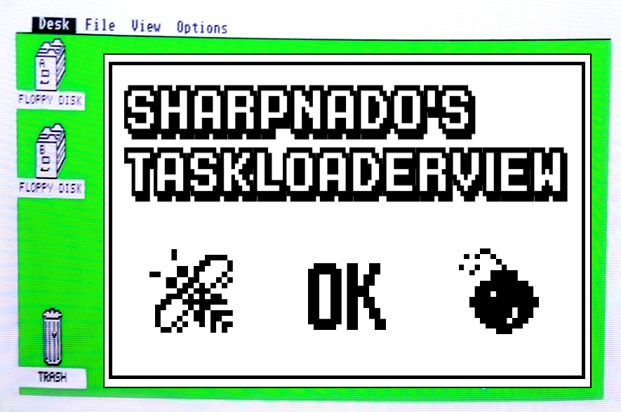

The `TaskLoaderView` is a UI component that handles all your UI loading state (Loading, Error, Result, Notification), and removes all the pain of async loading from your view models (try catch / async void / IsBusy / HasErrors / base view models / ...) thanks to its brother the `TaskLoaderNotifier`.

Featuring:

* Default layout for all loading states (`Loading`, `Error`, `Success`, `Notification`, `Refresh`)
* Stylable layouts including fonts, accent colors, error Docs, ...
* Any states are overridable with user custom views and easily positionned with AbsoluteLayout properties
* Support for `Xamarin.Forms.Skeleton` nuget package
* Support for refresh scenarios, and error while refreshing with the `ErrorNotificationView`
* Support loading task on demand with the `NotStarted` state
* `TaskLoaderNotifier` for the `ViewModel` side taking care of all the error handling and the `IsBusy` nonsense


It has been tested on **Android**, **iOS** and **UWP** platforms through the `Retronado` sample app.

It uses the Sharpnado's [TaskMonitor](https://github.com/roubachof/Sharpnado.TaskMonitor).

## `TaskLoaderView` features

### Default state views

The `TaskLoaderView` implements defaut view for all the task loading states:

* Loading, a simple ActivityLoader is displayed
* Error, an image with a retry button
* Success, your xaml inside the `TaskLoaderView`
* Notification, when an error occurs whereas some information has already been displayed
* Refresh, with a `RefreshView` for example

<table>
	<thead>
		<tr>
			<th>LoadingView</th>
			<th>Result</th>
            <th>ErrorView</th>
            <th>ErrorNotificationView</th>
		</tr>
	</thead>
	<tbody>
		<tr>
			<td>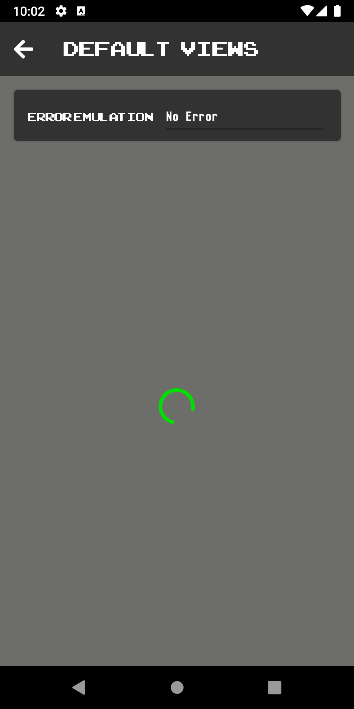</td>
			<td>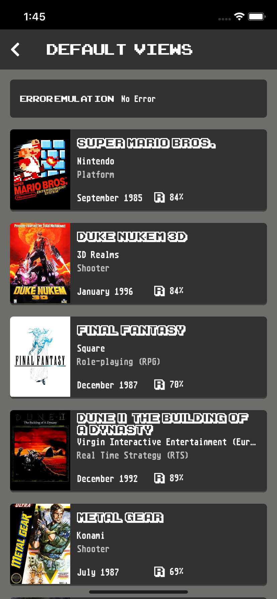</td>
            <td>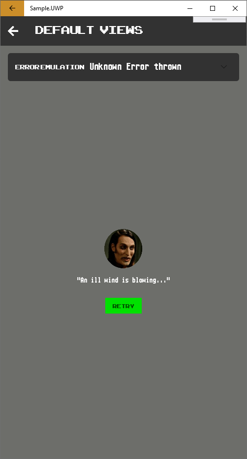</td>
            <td>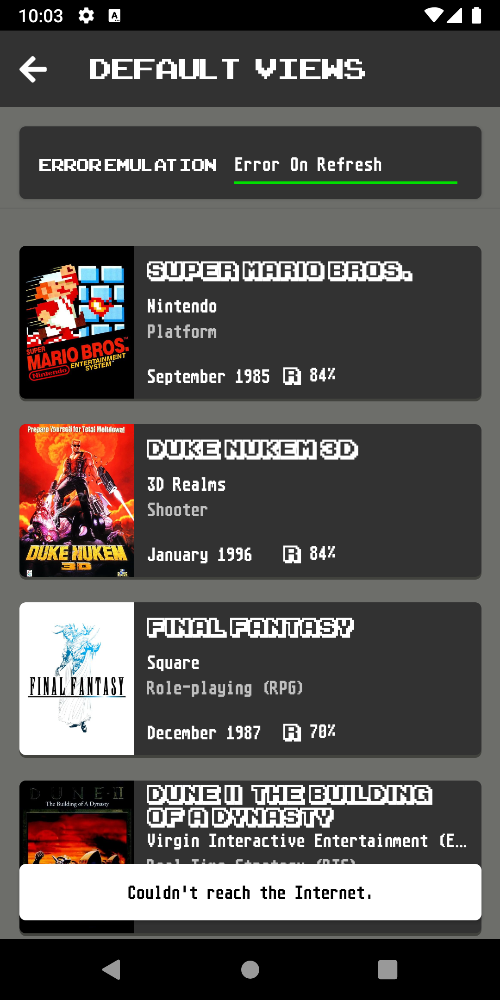</td>
		</tr>
  </tbody>
</table>

It is highly stylable, and you can even provide converters to translate an `Exception` to a meaningful image and message.

```xml
<ContentPage.Resources>
    <ResourceDictionary>
        <Style x:Key="TaskLoaderStyle" TargetType="customViews:TaskLoaderView">
            <Setter Property="AccentColor" Value="{StaticResource AccentColor}" />
            <Setter Property="FontFamily" Value="{StaticResource FontAtariSt}" />
            <Setter Property="EmptyStateMessage" Value="{loc:Translate Empty_Screen}" />
            <Setter Property="EmptyStateDocsource" Value="{inf:ImageResource Sample.Docs.dougal.png}" />
            <Setter Property="RetryButtonText" Value="{loc:Translate ErrorButton_Retry}" />
            <Setter Property="TextColor" Value="{StaticResource OnDarkColor}" />
            <Setter Property="ErrorImageConverter" Value="{StaticResource ExceptionToDocsourceConverter}" />
            <Setter Property="ErrorMessageConverter" Value="{StaticResource ExceptionToErrorMessageConverter}" />
            <Setter Property="BackgroundColor" Value="{StaticResource LightGreyBackground}" />
            <Setter Property="NotificationBackgroundColor" Value="{StaticResource TosWindows}" />
            <Setter Property="NotificationTextColor" Value="{StaticResource TextPrimaryColor}" />
        </Style>
    </ResourceDictionary>
</ContentPage.Resources>

...

<customViews:TaskLoaderView Grid.Row="2"
                            Style="{StaticResource TaskLoaderStyle}"
                            TaskLoaderNotifier="{Binding Loader}">
    <RefreshView Command="{Binding Loader.RefreshCommand}"
                    IsRefreshing="{Binding Loader.ShowRefresher}"
                    RefreshColor="{StaticResource AccentColor}">
        <ListView BackgroundColor="Transparent"
                    CachingStrategy="RecycleElementAndDataTemplate"
                    Header=""
                    ItemTemplate="{StaticResource GameDataTemplate}"
                    ItemsSource="{Binding Loader.Result}"
                    RowHeight="140"
                    SelectionMode="None"
                    SeparatorVisibility="None" />
    </RefreshView>
</customViews:TaskLoaderView>
```

```csharp
public class ExceptionToDocsourceConverter : IValueConverter
{
    public object Convert(object value, Type targetType, object parameter, CultureInfo culture)
    {
        if (value == null)
        {
            return null;
        }

        string imageName;

        switch (value)
        {
            case ServerException serverException:
                imageName = "server.png";
                break;
            case NetworkException networkException:
                imageName = "the_internet.png";
                break;
            default:
                imageName = "richmond.png";
                break;
        }

        return Docsource.FromFile(imageName);
    }
}
```

### User custom views

You can also override any state views to implement your own:

<table>
	<thead>
		<tr>
			<th>LoadingView (busy bee)</th>
			<th>Result</th>
            <th>ErrorView (atari st bombs)</th>
            <th>ErrorNotificationView (retro alert)</th>
		</tr>
	</thead>
	<tbody>
		<tr>
			<td>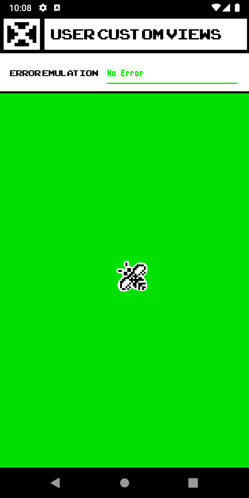</td>
			<td>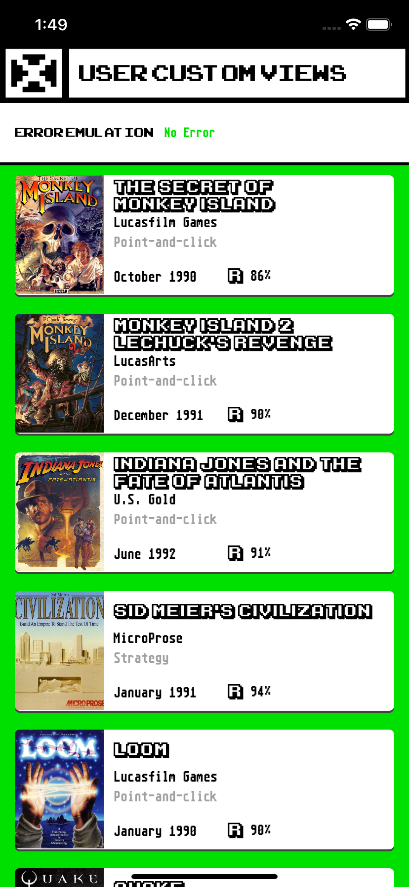</td>
            <td>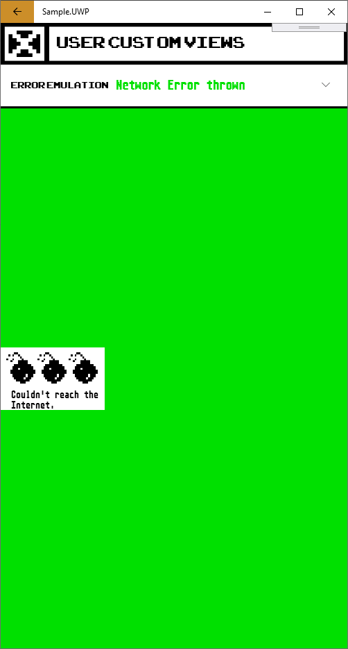</td>
            <td>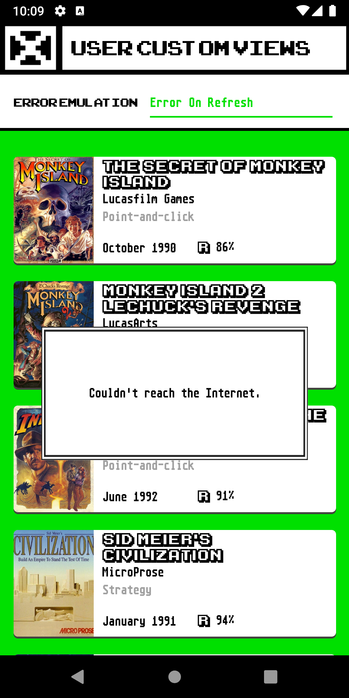</td>
		</tr>
  </tbody>
</table>

```xml
<sharpnado:TaskLoaderView x:Name="TaskLoaderView"
                            Grid.Row="3"
                            Style="{StaticResource TaskLoaderStyle}"
                            TaskLoaderNotifier="{Binding Loader}">

    <sharpnado:TaskLoaderView.LoadingView>
        <Image x:Name="BusyImage"
                AbsoluteLayout.LayoutFlags="PositionProportional"
                AbsoluteLayout.LayoutBounds="0.5, 0.5, 60, 60"
                Aspect="AspectFit"
                Source="{img:ImageResource Sample.Docs.busy_bee_white_bg.png}" />
    </sharpnado:TaskLoaderView.LoadingView>

    <sharpnado:TaskLoaderView.ErrorView>
        <Grid AbsoluteLayout.LayoutFlags="PositionProportional"
                AbsoluteLayout.LayoutBounds="0, 0.5, 150, 90"
                Padding="15,0,0,0"
                BackgroundColor="White">
            <Grid.RowDefinitions>
                <RowDefinition Height="60" />
                <RowDefinition Height="30" />
            </Grid.RowDefinitions>
            <Grid.ColumnDefinitions>
                <ColumnDefinition Width="*" />
                <ColumnDefinition Width="*" />
                <ColumnDefinition Width="*" />
            </Grid.ColumnDefinitions>
            <Image Grid.Row="0"
                    Grid.Column="0"
                    Style="{StaticResource ErrorBombStyle}" />
            <Image Grid.Row="0"
                    Grid.Column="1"
                    Style="{StaticResource ErrorBombStyle}" />
            <Image Grid.Row="0"
                    Grid.Column="2"
                    Style="{StaticResource ErrorBombStyle}" />
            <Label Grid.Row="1"
                    Grid.Column="0"
                    Grid.ColumnSpan="3"
                    Style="{StaticResource TextBody}"
                    Text="{Binding Loader.Error, Converter={StaticResource ExceptionToErrorMessageConverter}}" />
        </Grid>
    </sharpnado:TaskLoaderView.ErrorView>

    <sharpnado:TaskLoaderView.ErrorNotificationView>
        <Grid x:Name="ErrorNotificationView"
                AbsoluteLayout.LayoutFlags="PositionProportional"
                AbsoluteLayout.LayoutBounds="0.5, 0.5, 300, 150"
                Scale="0">
            <Grid.Behaviors>
                <behaviors:TimedVisibilityBehavior VisibilityInSeconds="4" />
            </Grid.Behaviors>
            <Image Aspect="Fill" Source="{img:ImageResource Sample.Docs.window_border.png}" />
            <Label Style="{StaticResource TextBody}"
                    Margin="{StaticResource ThicknessLarge}"
                    VerticalOptions="Center"
                    HorizontalTextAlignment="Center"
                    Text="{Binding Loader.Error, Converter={StaticResource ExceptionToErrorMessageConverter}}" />
        </Grid>
    </sharpnado:TaskLoaderView.ErrorNotificationView>

    <RefreshView Command="{Binding Loader.RefreshCommand}"
                    IsRefreshing="{Binding Loader.ShowRefresher}"
                    RefreshColor="{StaticResource AccentColor}">
        <ListView BackgroundColor="Transparent"
                    CachingStrategy="RecycleElementAndDataTemplate"
                    Header=""
                    ItemTemplate="{StaticResource GameDataTemplate}"
                    ItemsSource="{Binding Loader.Result}"
                    RowHeight="140"
                    SelectionMode="None"
                    SeparatorVisibility="None" />
    </RefreshView>
</sharpnado:TaskLoaderView>
```

You can see that the `TaskLoaderView` uses an `AbsoluteLayout` internally. So you can use `AbsoluteLayout` bounds and flags to position your views.

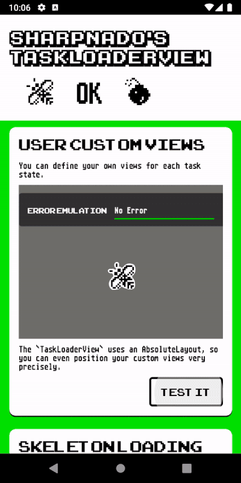

### Support for Xamarin.Forms.Skeleton

Have you tried the Skeleton loading properties from Horus?

https://github.com/HorusSoftwareUY/Xamarin.Forms.Skeleton

It's brilliant! The `TaskLoaderView` is supporting a simpler use case of the properties by binding directly to the `TaskLoaderNotifier`. With this method you don't have to create fake item view models in your page view model. 

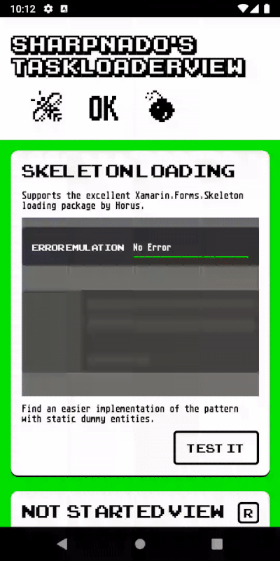

In case of a list: you just have to create a static array of item view models.

```xml
<customViews:TaskLoaderView x:Name="GamesTaskLoader"
                            Grid.Row="2"
                            Style="{StaticResource TaskLoaderStyle}"
                            TaskLoaderNotifier="{Binding Loader}">
    <customViews:TaskLoaderView.LoadingView>
        <ListView Style="{StaticResource ListGameStyle}"
                    sk:Skeleton.Animation="Fade"
                    sk:Skeleton.IsBusy="{Binding Loader.ShowLoader}"
                    sk:Skeleton.IsParent="True"
                    ItemTemplate="{StaticResource GameSkeletonViewCell}"
                    ItemsSource="{x:Static views:Skeletons.Games}"
                    VerticalScrollBarVisibility="Never" />
    </customViews:TaskLoaderView.LoadingView>


    <RefreshView Command="{Binding Loader.RefreshCommand}"
                    IsRefreshing="{Binding Loader.ShowRefresher}"
                    RefreshColor="{StaticResource AccentColor}">
        <ListView Style="{StaticResource ListGameStyle}"
                    CachingStrategy="RecycleElementAndDataTemplate"
                    ItemTemplate="{StaticResource GameSkeletonViewCell}"
                    ItemsSource="{Binding Loader.Result}" />
    </RefreshView>
</customViews:TaskLoaderView>
```

```csharp
public static class Skeletons
{
    public static Game[] Games = new[]
        {
            new Game(
                0,
                null,
                null,
                DateTime.Now,
                new List<Genre> { new Genre(1, "Genre genre") },
                new List<Company> { new Company(1, "The Company") },
                "Name name name",
                null),
            new Game(
                0,
                null,
                null,
                DateTime.Now,
                new List<Genre> { new Genre(1, "Genre genre") },
                new List<Company> { new Company(1, "The Company") },
                "Name name name",
                null),
            new Game(
                0,
                null,
                null,
                DateTime.Now,
                new List<Genre> { new Genre(1, "Genre genre") },
                new List<Company> { new Company(1, "The Company") },
                "Name name name",
                null),
        }
}
```

If you are not loading a list but a simple object, you don't even have to use a custom `LoadingView`, you can just use the `TaskLoaderType="ResultAsLoadingView"` property.

```xml
<sharpnado:TaskLoaderView Grid.Row="2"
                            Grid.Column="0"
                            Grid.ColumnSpan="2"
                            AccentColor="{StaticResource AccentColor}"
                            ErrorImageConverter="{StaticResource ExceptionToDocsourceConverter}"
                            ErrorMessageConverter="{StaticResource ExceptionToErrorMessageConverter}"
                            FontFamily="{StaticResource FontAtariSt}"
                            TaskLoaderNotifier="{Binding RandomGameLoader}"
                            TaskLoaderType="ResultAsLoadingView"
                            TextColor="Black">

    <Frame Style="{StaticResource CardStyle}"
            Margin="-15,0,-15,-15"
            Padding="0"
            skeleton:Skeleton.Animation="Beat"
            skeleton:Skeleton.IsBusy="{Binding RandomGameLoader.ShowLoader}"
            skeleton:Skeleton.IsParent="True"
            BackgroundColor="{DynamicResource CellBackgroundColor}"
            CornerRadius="10"
            IsClippedToBounds="True">
        <Grid>
            <Grid.RowDefinitions>
                <RowDefinition Height="160" />
                <RowDefinition Height="40" />
                <RowDefinition Height="20" />
                <RowDefinition Height="20" />
            </Grid.RowDefinitions>
            <Image Grid.Row="0"
                    skeleton:Skeleton.BackgroundColor="{StaticResource GreyBackground}"
                    skeleton:Skeleton.IsBusy="{Binding RandomGameLoader.ShowLoader}"
                    Aspect="AspectFill"
                    Source="{Binding RandomGameLoader.Result.ScreenshotUrl}" />

            <Label Grid.Row="1"
                    Style="{StaticResource GameName}"
                    Margin="15,0"
                    skeleton:Skeleton.BackgroundColor="{StaticResource GreyBackground}"
                    skeleton:Skeleton.IsBusy="{Binding RandomGameLoader.ShowLoader}"
                    Text="{Binding RandomGameLoader.Result.Name}" />

            <Label Grid.Row="2"
                    Style="{StaticResource GameCompany}"
                    Margin="15,0"
                    skeleton:Skeleton.BackgroundColor="{StaticResource GreyBackground}"
                    skeleton:Skeleton.IsBusy="{Binding RandomGameLoader.ShowLoader}"
                    Text="{Binding RandomGameLoader.Result.MajorCompany}" />

            <Label Grid.Row="3"
                    Style="{StaticResource GameGenre}"
                    Margin="15,0"
                    Text="{Binding RandomGameLoader.Result.MajorGenre}" />
        </Grid>
    </Frame>

</sharpnado:TaskLoaderView>
```

### Loading task on demand: NotStartedView 

A `NotStartedView` state is also available so you can display a view before loading the `Task`.
It is quite useful for load-on-demand.

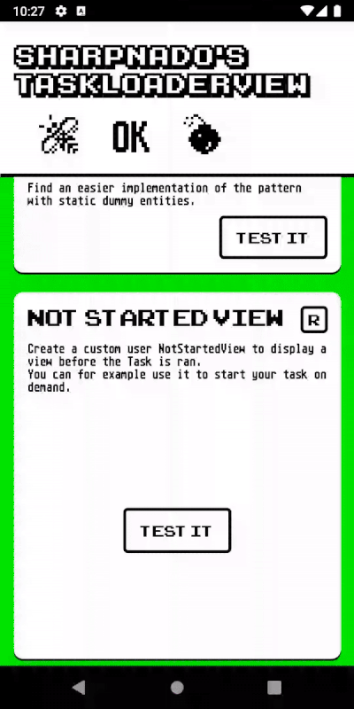

Here `TaskLoaderType="ResultAsLoadingView"` is set cause we are using the skeleton loading for just one object.

```xml
<sharpnado:TaskLoaderView Grid.Row="2"
                            Grid.Column="0"
                            Grid.ColumnSpan="2"
                            AccentColor="{StaticResource AccentColor}"
                            ErrorImageConverter="{StaticResource ExceptionToDocsourceConverter}"
                            ErrorMessageConverter="{StaticResource ExceptionToErrorMessageConverter}"
                            FontFamily="{StaticResource FontAtariSt}"
                            TaskLoaderNotifier="{Binding RandomGameLoader}"
                            TaskLoaderType="ResultAsLoadingView"
                            TextColor="Black">
    <sharpnado:TaskLoaderView.NotStartedView>
        <Button AbsoluteLayout.LayoutFlags="PositionProportional"
                AbsoluteLayout.LayoutBounds="0.5, 0.5, 120, 50"
                Style="{StaticResource ButtonTextIt}"
                Command="{Binding LoadRandomGameCommand}" />
    </sharpnado:TaskLoaderView.NotStartedView>

    <Frame Style="{StaticResource CardStyle}"
            Margin="-15,0,-15,-15"
            Padding="0"
            skeleton:Skeleton.Animation="Beat"
            skeleton:Skeleton.IsBusy="{Binding RandomGameLoader.ShowLoader}"
            skeleton:Skeleton.IsParent="True"
            BackgroundColor="{DynamicResource CellBackgroundColor}"
            CornerRadius="10"
            IsClippedToBounds="True">
        ...
    </Frame>
</sharpnado:TaskLoaderView
```

```csharp
public class LoadOnDemandViewModel : Bindable
{
    private readonly IRetroGamingService _retroGamingService;

    public LoadOnDemandViewModel(IRetroGamingService retroGamingService)
    {
        _retroGamingService = retroGamingService;

        RandomGameLoader = new TaskLoaderNotifier<Game>();

        LoadRandomGameCommand = new Command(
            () => { RandomGameLoader.Load(GetRandomGame); });
    }

    public TaskLoaderNotifier<Game> RandomGameLoader { get; }

    public ICommand LoadRandomGameCommand { get; }

    private async Task<Game> GetRandomGame()
    {
        await Task.Delay(TimeSpan.FromSeconds(4));

        if (DateTime.Now.Millisecond % 2 == 0)
        {
            throw new NetworkException();
        }

        return await _retroGamingService.GetRandomGame();
    }
}
```

### ErrorNotificationView

We tend to forget a state in our `Task` loading cycle: the notification view.

Consider this scenario:

1. we are loading a list of retro game
2. loading is successfull: the list is displayed
3. we are refreshing the list
4. oops an error occurs
5. do we want to see the error view although the items were correctly loaded before?

NO! We just want to see a nice snackbar warning the user about it.

The `ErrorNotificationView` is also customizable if you like. It's brought to you with a nice `TimedVisibilityBehavior` so that you can specify how much time it needs to be shown to the user.

<table>
	<thead>
		<tr>
			<th>Default view</th>
            <th>User custom view</th>
		</tr>
	</thead>
	<tbody>
		<tr>
			<td>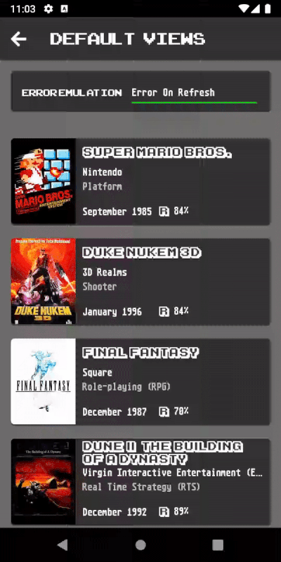</td>
			<td>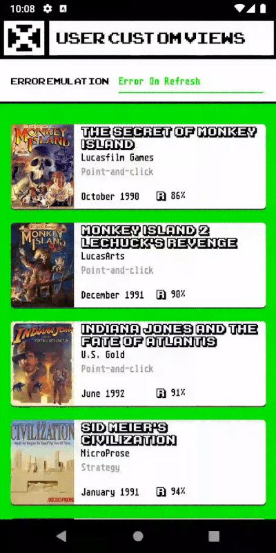</td>
		</tr>
  </tbody>
</table>

```xml
<sharpnado:TaskLoaderView.ErrorNotificationView>
    <Grid x:Name="ErrorNotificationView"
            AbsoluteLayout.LayoutFlags="PositionProportional"
            AbsoluteLayout.LayoutBounds="0.5, 0.5, 300, 150"
            Scale="0">
        <Grid.Behaviors>
            <behaviors:TimedVisibilityBehavior VisibilityInSeconds="4" />
        </Grid.Behaviors>
        <Image Aspect="Fill" Source="{img:ImageResource Sample.Docs.window_border.png}" />
        <Label Style="{StaticResource TextBody}"
                Margin="{StaticResource ThicknessLarge}"
                VerticalOptions="Center"
                HorizontalTextAlignment="Center"
                Text="{Binding Loader.Error, Converter={StaticResource ExceptionToErrorMessageConverter}}" />
    </Grid>
</sharpnado:TaskLoaderView.ErrorNotificationView>
```

### RefreshCommand

Just bind the `RefreshCommand` to the `RefreshView` and `IsRefreshing` to the `ShowRefresher` property.

```xml
<RefreshView Command="{Binding Loader.RefreshCommand}"
                IsRefreshing="{Binding Loader.ShowRefresher}"
                RefreshColor="{StaticResource AccentColor}">
    <ListView Style="{StaticResource ListGameStyle}"
                CachingStrategy="RecycleElementAndDataTemplate"
                ItemTemplate="{StaticResource GameSkeletonViewCell}"
                ItemsSource="{Binding Loader.Result}" />
</RefreshView>
```

## ViewModel side: remove all the pain with `TaskLoaderNotifier`

For more about that, you can read this post on Sharpnado: https://www.sharpnado.com/taskloaderview-async-init-made-easy/.

For deeper understanding of Composition vs Inheritance, my session at XamExpertDay: https://github.com/roubachof/SLIDES_FreeYourselfFromIsBusy.

The `TaskLoaderNotifier` is a loading component for your tasks, and is commonly used in your view models.

```csharp
public class RetroGamesViewModel : ANavigableViewModel
{
    private readonly IRetroGamingService _retroGamingService;

    public RetroGamesViewModel(
        INavigationService navigationService, 
        IRetroGamingService retroGamingService)
        : base(navigationService)
    {
        _retroGamingService = retroGamingService;

        RefreshCommand = new Command(() => Load(null));
        Loader = new TaskLoaderNotifier<List<Game>>();
    }

    public TaskLoaderNotifier<List<Game>> Loader { get; }

    public ICommand RefreshCommand { get; }

    public override void Load(object parameter)
    {
        // TaskStartMode = Manual (Default mode)
        Loader.Load(InitializeAsync);
    }

    private async Task<List<Game>> InitializeAsync()
    {
        ...
    }
}
```

And that's all. It wraps all the states of the task (NotStarted, Loading, Fault, Success).
You can just stop worrying about `IsBusy`, `HasErrors`, `ErrorMessage`, `IsRefreshing`...

You bind your `TaskLoaderNotifier` to your `TaskLoaderView`, and the magic happens.

```xml
<customViews:TaskLoaderView Grid.Row="2"
                            Style="{StaticResource TaskLoaderStyle}"
                            TaskLoaderNotifier="{Binding Loader}">
    <RefreshView Command="{Binding Loader.RefreshCommand}"
                    IsRefreshing="{Binding Loader.ShowRefresher}"
                    RefreshColor="{StaticResource AccentColor}">
        <ListView BackgroundColor="Transparent"
                    CachingStrategy="RecycleElementAndDataTemplate"
                    Header=""
                    ItemTemplate="{StaticResource GameDataTemplate}"
                    ItemsSource="{Binding Loader.Result}"
                    RowHeight="140"
                    SelectionMode="None"
                    SeparatorVisibility="None" />
    </RefreshView>
</customViews:TaskLoaderView>
```

And just with those 2 chunks of code you are now handling all the loading states of your view model :)

## Introducing the Retronado sample app

The sample highlighting the possibilities of the `TaskLoaderView` is a tribute to the TOS of the Atari ST and its famous "busy bee".

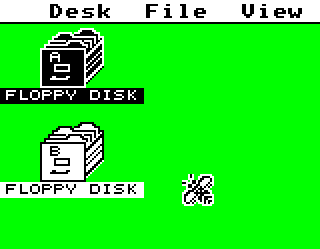

It includes a random collection of retro games provided by the [IGDB v3 API](https://www.igdb.com/api).

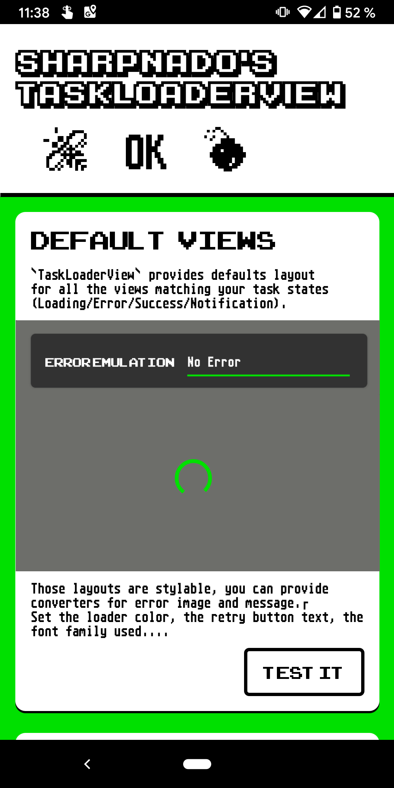